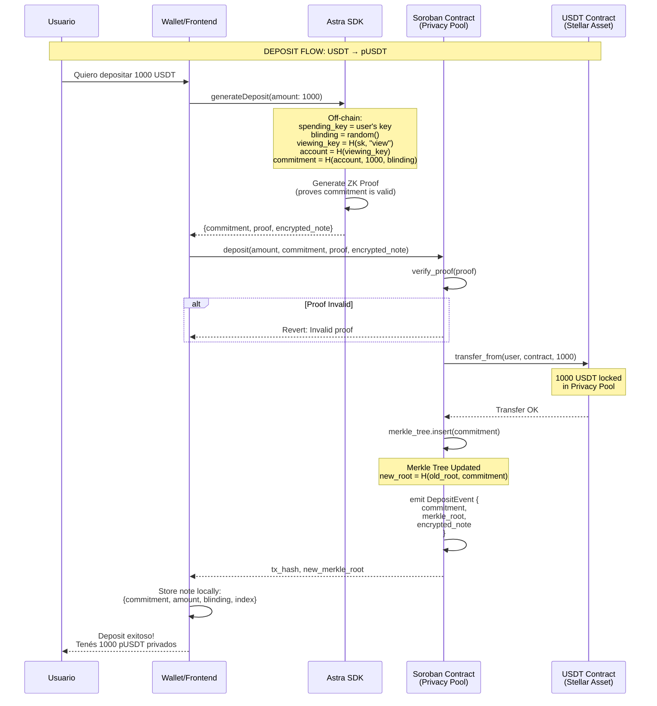
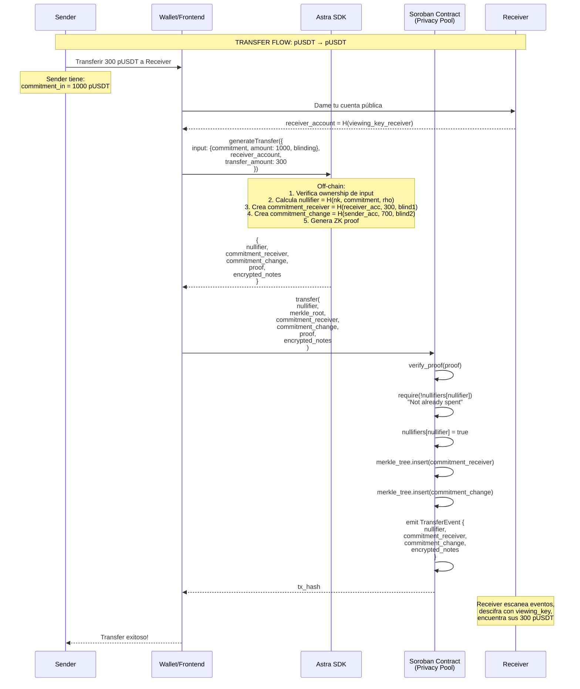
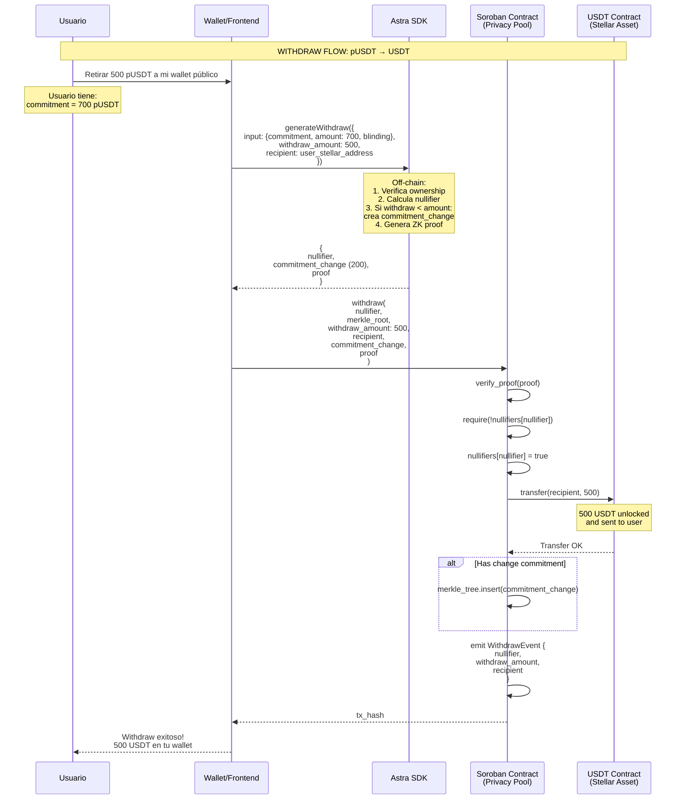

# Astra Privacy System - Flujos

## Version: 1.0.0
## Date: 2025-11-22

---

## Resumen del Sistema

Astra es un sistema de privacidad sobre Stellar que permite convertir tokens públicos (USDT, USDC, etc.) en tokens privados (pUSDT, pUSDC) usando Zero-Knowledge Proofs.

```
┌─────────────────────────────────────────────────────────────────────┐
│                         ASTRA PRIVACY SYSTEM                         │
├─────────────────────────────────────────────────────────────────────┤
│                                                                      │
│   PÚBLICO                    PRIVADO                    PÚBLICO     │
│   ────────                   ───────                    ────────    │
│                                                                      │
│   ┌──────┐    DEPOSIT    ┌──────────────┐   WITHDRAW   ┌──────┐    │
│   │ USDT │ ────────────▶ │    pUSDT     │ ───────────▶ │ USDT │    │
│   └──────┘               │  (privado)   │              └──────┘    │
│                          └──────────────┘                           │
│                                 │                                    │
│                                 │ TRANSFER                          │
│                                 ▼                                    │
│                          ┌──────────────┐                           │
│                          │    pUSDT     │                           │
│                          │ (otro owner) │                           │
│                          └──────────────┘                           │
│                                                                      │
└─────────────────────────────────────────────────────────────────────┘
```

---

## 1. Deposit Flow (USDT → pUSDT)

### 1.1 Descripción

El usuario deposita tokens públicos (USDT) en el Privacy Pool y recibe un commitment que representa su balance privado.

### 1.2 Diagrama de Secuencia



### 1.3 Diagrama de Estado

```
┌─────────────────────────────────────────────────────────────────────┐
│                        DEPOSIT: USDT → pUSDT                         │
├─────────────────────────────────────────────────────────────────────┤
│                                                                      │
│  ANTES                              DESPUÉS                         │
│  ──────                             ───────                         │
│                                                                      │
│  Usuario:                           Usuario:                        │
│  ├─ USDT: 5000                      ├─ USDT: 4000                   │
│  └─ pUSDT: 0                        └─ pUSDT: 1000 (commitment)     │
│                                         └─ note: {amt, blind, idx}  │
│                                                                      │
│  Privacy Pool:                      Privacy Pool:                   │
│  ├─ USDT locked: 10000              ├─ USDT locked: 11000           │
│  └─ Merkle Tree:                    └─ Merkle Tree:                 │
│      root: 0xabc...                     root: 0xdef...              │
│      leaves: [c1, c2, c3]               leaves: [c1, c2, c3, c4]    │
│                                                                      │
└─────────────────────────────────────────────────────────────────────┘
```

### 1.4 Datos On-chain vs Off-chain

| Dato | On-chain | Off-chain (Usuario) | Visible al público |
|------|----------|---------------------|-------------------|
| commitment | ✅ | ✅ | ✅ (pero no revela nada) |
| amount | ❌ | ✅ | ❌ |
| blinding | ❌ | ✅ | ❌ |
| spending_key | ❌ | ✅ | ❌ |
| viewing_key | ❌ | ✅ | ❌ |
| merkle_root | ✅ | ✅ | ✅ |
| encrypted_note | ✅ | ✅ (puede descifrar) | ✅ (pero encriptado) |

### 1.5 Circuit Inputs/Outputs

```noir
// deposit/src/main.nr

fn main(
    // === PRIVATE INPUTS (solo el prover conoce) ===
    spending_key: Field,           // Clave secreta del usuario
    blinding: Field,               // Factor de randomización

    // === PUBLIC INPUTS (verificables on-chain) ===
    amount: pub Field,             // Monto a depositar
    commitment: pub Field,         // H(account, amount, blinding)
    merkle_root: pub Field,        // Nueva raíz del árbol
    encrypted_note: pub [Field; 4] // Nota encriptada (opcional Phase 2)
) {
    // 1. Derivar viewing key y account
    let viewing_key = Poseidon2::hash([spending_key, VIEWING_DOMAIN], 2);
    let account = Poseidon2::hash([viewing_key], 1);

    // 2. Verificar que commitment es correcto
    let expected_commitment = Poseidon2::hash([account, amount, blinding], 3);
    assert(commitment == expected_commitment);

    // 3. Verificar merkle tree update (simplified)
    // ...
}
```

---

## 2. Transfer Flow (pUSDT → pUSDT)

### 2.1 Descripción

El usuario transfiere tokens privados a otro usuario. Se "quema" el commitment original (nullifier) y se crean dos nuevos commitments: uno para el receptor y otro para el cambio.

### 2.2 Diagrama de Secuencia



### 2.3 Diagrama de Estado

```
┌─────────────────────────────────────────────────────────────────────┐
│                    TRANSFER: Sender → Receiver                       │
├─────────────────────────────────────────────────────────────────────┤
│                                                                      │
│  ANTES                              DESPUÉS                         │
│  ──────                             ───────                         │
│                                                                      │
│  Sender:                            Sender:                         │
│  └─ commitment_1: 1000 pUSDT        └─ commitment_3: 700 pUSDT      │
│                                        (cambio)                     │
│                                                                      │
│  Receiver:                          Receiver:                       │
│  └─ (nada)                          └─ commitment_2: 300 pUSDT      │
│                                                                      │
│  Privacy Pool:                      Privacy Pool:                   │
│  ├─ USDT locked: 11000              ├─ USDT locked: 11000           │
│  │  (no cambia!)                    │  (no cambia!)                 │
│  ├─ Nullifiers: [n1, n2]            ├─ Nullifiers: [n1, n2, n3]     │
│  └─ Merkle Tree:                    └─ Merkle Tree:                 │
│      leaves: [c1, c2, c3, c4]           leaves: [..., c5, c6]       │
│                                                                      │
│  commitment_1 está "quemado"        Nadie sabe que c5 es de 300     │
│  (nullifier publicado)              ni que c6 es de 700             │
│                                                                      │
└─────────────────────────────────────────────────────────────────────┘
```

### 2.4 El Nullifier - Clave del Sistema

```
┌─────────────────────────────────────────────────────────────────────┐
│                           NULLIFIER                                  │
├─────────────────────────────────────────────────────────────────────┤
│                                                                      │
│  ¿Qué es?                                                           │
│  ─────────                                                          │
│  Un identificador único derivado de un commitment que se publica    │
│  cuando se "gasta" ese commitment. Previene double-spending.        │
│                                                                      │
│  nullifier = Poseidon2(nullifier_key, commitment, rho)              │
│                                                                      │
│  Propiedades:                                                       │
│  ────────────                                                       │
│  ✅ Único por commitment (no hay colisiones)                        │
│  ✅ No revela qué commitment se gastó                               │
│  ✅ Solo el owner puede generarlo (necesita nullifier_key)          │
│  ✅ Una vez publicado, el commitment no puede gastarse de nuevo     │
│                                                                      │
│  Flujo:                                                             │
│  ──────                                                             │
│  1. Usuario tiene commitment C                                      │
│  2. Para gastar, genera nullifier N = f(nk, C, rho)                 │
│  3. Publica N on-chain                                              │
│  4. Contrato verifica que N no existe en nullifier_set              │
│  5. Contrato agrega N al nullifier_set                              │
│  6. Si alguien intenta gastar C de nuevo → genera mismo N → FALLA   │
│                                                                      │
└─────────────────────────────────────────────────────────────────────┘
```

---

## 3. Withdraw Flow (pUSDT → USDT)

### 3.1 Descripción

El usuario retira tokens privados y los convierte de vuelta en tokens públicos.

### 3.2 Diagrama de Secuencia



### 3.3 Diagrama de Estado

```
┌─────────────────────────────────────────────────────────────────────┐
│                     WITHDRAW: pUSDT → USDT                           │
├─────────────────────────────────────────────────────────────────────┤
│                                                                      │
│  ANTES                              DESPUÉS                         │
│  ──────                             ───────                         │
│                                                                      │
│  Usuario:                           Usuario:                        │
│  ├─ USDT: 4000                      ├─ USDT: 4500 (+500)            │
│  └─ pUSDT: commitment (700)         └─ pUSDT: commitment_new (200)  │
│                                                                      │
│  Privacy Pool:                      Privacy Pool:                   │
│  ├─ USDT locked: 11000              ├─ USDT locked: 10500 (-500)    │
│  ├─ Nullifiers: [...]               ├─ Nullifiers: [..., n_new]     │
│  └─ Merkle Tree:                    └─ Merkle Tree:                 │
│      (commitment está ahí)              (commitment_new agregado)   │
│                                                                      │
│  El commitment original queda       500 USDT salen del pool         │
│  "quemado" (nullifier publicado)    200 pUSDT quedan como cambio    │
│                                                                      │
└─────────────────────────────────────────────────────────────────────┘
```

---

## 4. Resumen de Operaciones

```
┌─────────────────────────────────────────────────────────────────────┐
│                    RESUMEN DE OPERACIONES                            │
├─────────────────────────────────────────────────────────────────────┤
│                                                                      │
│  Operación    │ Inputs              │ Outputs            │ USDT     │
│  ─────────────┼─────────────────────┼────────────────────┼──────────│
│  DEPOSIT      │ USDT (público)      │ commitment         │ +locked  │
│               │                     │ encrypted_note     │          │
│  ─────────────┼─────────────────────┼────────────────────┼──────────│
│  TRANSFER     │ nullifier           │ commitment_recv    │ (igual)  │
│               │ merkle_proof        │ commitment_change  │          │
│               │                     │ encrypted_notes    │          │
│  ─────────────┼─────────────────────┼────────────────────┼──────────│
│  WITHDRAW     │ nullifier           │ USDT (público)     │ -locked  │
│               │ merkle_proof        │ commitment_change? │          │
│               │ recipient           │                    │          │
│                                                                      │
└─────────────────────────────────────────────────────────────────────┘
```

---

## 5. Invariantes del Sistema

```
┌─────────────────────────────────────────────────────────────────────┐
│                    INVARIANTES (siempre verdadero)                   │
├─────────────────────────────────────────────────────────────────────┤
│                                                                      │
│  1. CONSERVACIÓN DE VALOR                                           │
│     ─────────────────────                                           │
│     Σ(USDT locked) = Σ(valores de commitments no gastados)          │
│                                                                      │
│  2. NO DOUBLE-SPENDING                                              │
│     ────────────────────                                            │
│     Cada commitment solo puede generar UN nullifier                 │
│     Una vez publicado el nullifier, el commitment está "muerto"     │
│                                                                      │
│  3. PRIVACIDAD                                                      │
│     ─────────                                                       │
│     Observador on-chain NO puede determinar:                        │
│     - Quién es el owner de un commitment                            │
│     - Cuánto vale un commitment                                     │
│     - Qué commitment se gastó (solo ve nullifier)                   │
│     - Relación sender-receiver en transfers                         │
│                                                                      │
│  4. VERIFICABILIDAD                                                 │
│     ──────────────                                                  │
│     Todas las operaciones tienen ZK proof verificable on-chain      │
│     No se requiere confianza en ningún tercero                      │
│                                                                      │
└─────────────────────────────────────────────────────────────────────┘
```

---

## Referencias

- [VIEWING_KEYS_SPEC.md](./VIEWING_KEYS_SPEC.md) - Especificación de viewing keys
- [ENCRYPTED_NOTES_SPEC.md](./ENCRYPTED_NOTES_SPEC.md) - Especificación de notas encriptadas
- [UltraHonk Verifier](../../../ultrahonk_soroban_contract/) - Contrato verificador

---

## Changelog

| Version | Date | Changes |
|---------|------|---------|
| 1.0.0 | 2025-11-22 | Initial version with deposit, transfer, withdraw flows |
