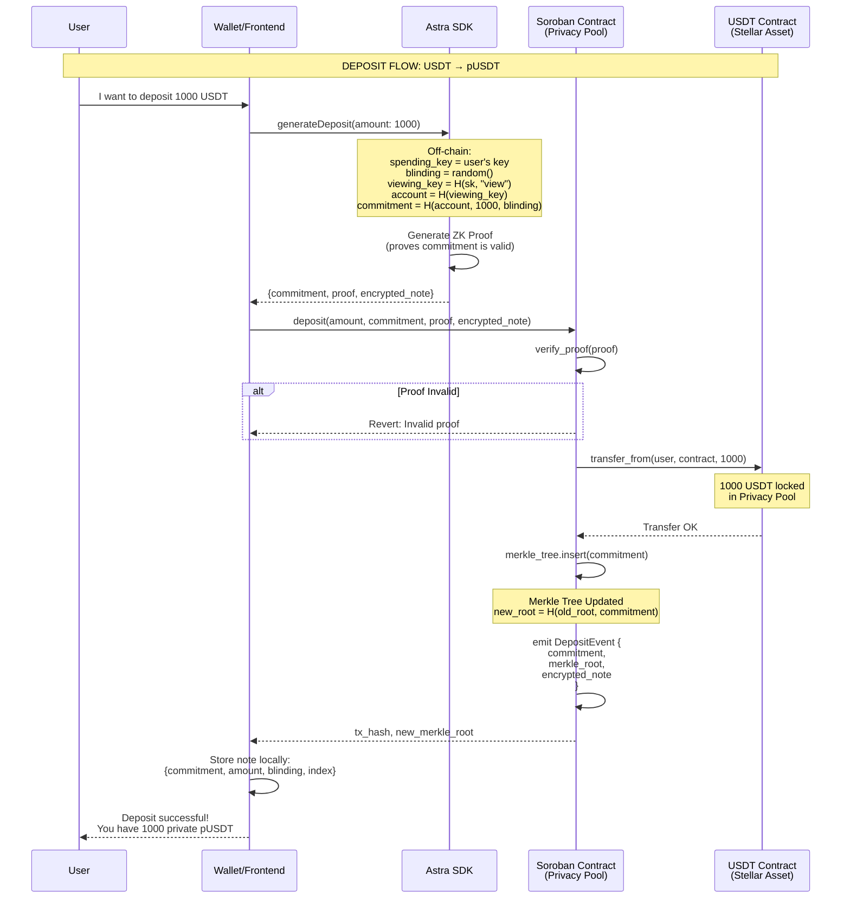
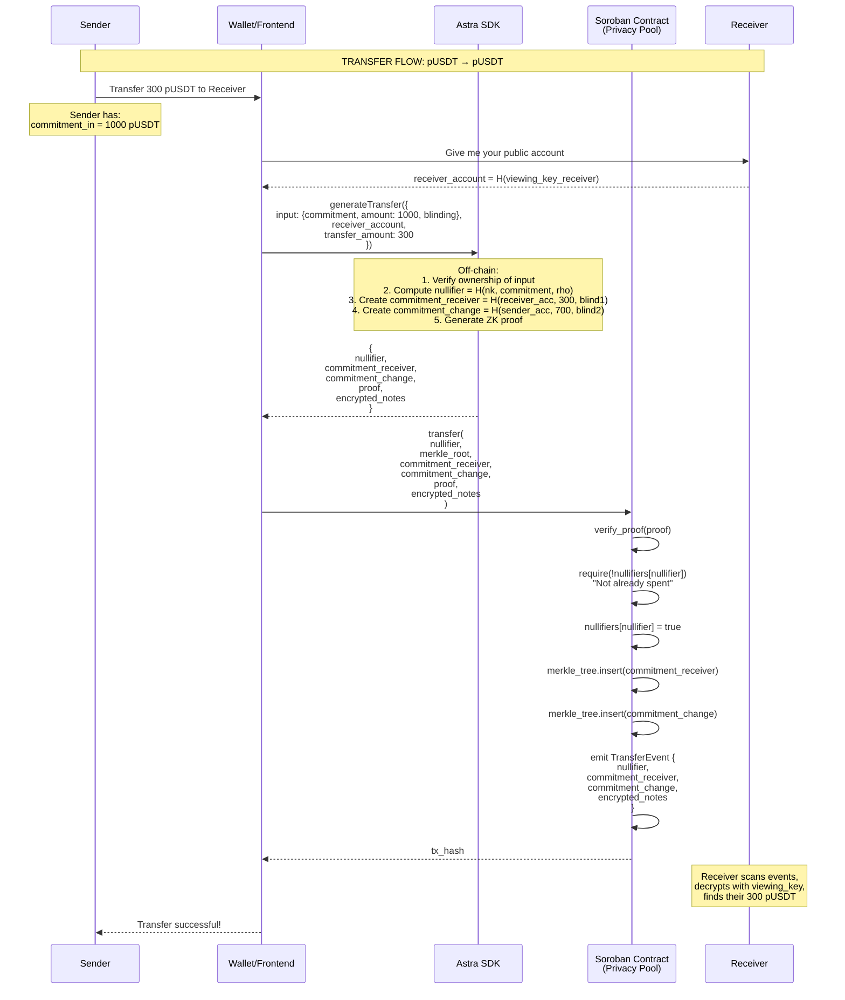
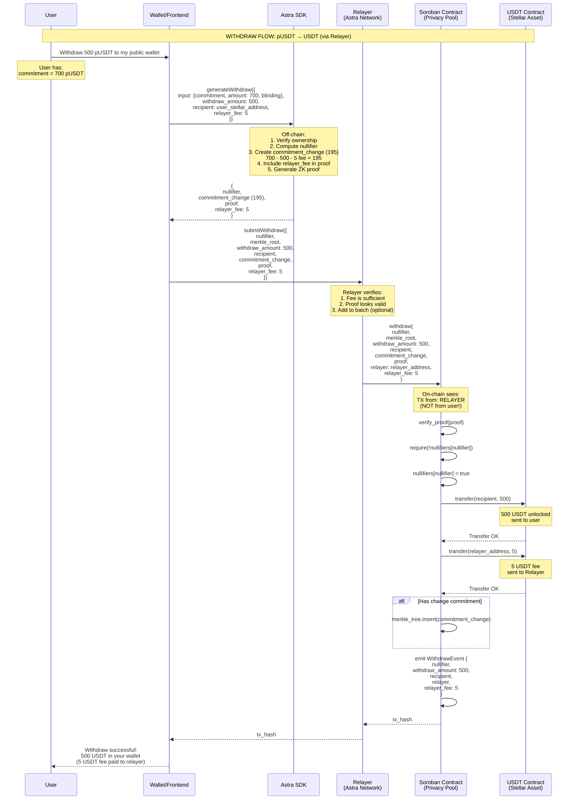

# Astra Privacy System - Flows

## Version: 1.0.0
## Date: 2025-11-22

---

## System Overview

Astra is a privacy system on Stellar that allows converting public tokens (USDT, USDC, etc.) into private tokens (pUSDT, pUSDC) using Zero-Knowledge Proofs.

```
┌─────────────────────────────────────────────────────────────────────┐
│                         ASTRA PRIVACY SYSTEM                         │
├─────────────────────────────────────────────────────────────────────┤
│                                                                      │
│   PUBLIC                       PRIVATE                    PUBLIC    │
│   ──────                       ───────                    ──────    │
│                                                                      │
│   ┌──────┐    DEPOSIT    ┌──────────────┐   WITHDRAW   ┌──────┐    │
│   │ USDT │ ────────────▶ │    pUSDT     │ ───────────▶ │ USDT │    │
│   └──────┘               │  (private)   │              └──────┘    │
│                          └──────────────┘                           │
│                                 │                                    │
│                                 │ TRANSFER                          │
│                                 ▼                                    │
│                          ┌──────────────┐                           │
│                          │    pUSDT     │                           │
│                          │ (new owner)  │                           │
│                          └──────────────┘                           │
│                                                                      │
└─────────────────────────────────────────────────────────────────────┘
```

---

## 1. Deposit Flow (USDT → pUSDT)

### 1.1 Description

The user deposits public tokens (USDT) into the Privacy Pool and receives a commitment representing their private balance.

### 1.2 Sequence Diagram



### 1.3 State Diagram

```
┌─────────────────────────────────────────────────────────────────────┐
│                        DEPOSIT: USDT → pUSDT                         │
├─────────────────────────────────────────────────────────────────────┤
│                                                                      │
│  BEFORE                            AFTER                            │
│  ──────                            ─────                            │
│                                                                      │
│  User:                             User:                            │
│  ├─ USDT: 5000                     ├─ USDT: 4000                    │
│  └─ pUSDT: 0                       └─ pUSDT: 1000 (commitment)      │
│                                        └─ note: {amt, blind, idx}   │
│                                                                      │
│  Privacy Pool:                     Privacy Pool:                    │
│  ├─ USDT locked: 10000             ├─ USDT locked: 11000            │
│  └─ Merkle Tree:                   └─ Merkle Tree:                  │
│      root: 0xabc...                    root: 0xdef...               │
│      leaves: [c1, c2, c3]              leaves: [c1, c2, c3, c4]     │
│                                                                      │
└─────────────────────────────────────────────────────────────────────┘
```

### 1.4 On-chain vs Off-chain Data

| Data | On-chain | Off-chain (User) | Publicly Visible |
|------|----------|------------------|------------------|
| commitment | ✅ | ✅ | ✅ (but reveals nothing) |
| amount | ❌ | ✅ | ❌ |
| blinding | ❌ | ✅ | ❌ |
| spending_key | ❌ | ✅ | ❌ |
| viewing_key | ❌ | ✅ | ❌ |
| merkle_root | ✅ | ✅ | ✅ |
| encrypted_note | ✅ | ✅ (can decrypt) | ✅ (but encrypted) |

### 1.5 Circuit Inputs/Outputs

```noir
// deposit/src/main.nr

fn main(
    // === PRIVATE INPUTS (only prover knows) ===
    spending_key: Field,           // User's secret key
    blinding: Field,               // Randomization factor

    // === PUBLIC INPUTS (verifiable on-chain) ===
    amount: pub Field,             // Amount to deposit
    commitment: pub Field,         // H(account, amount, blinding)
    merkle_root: pub Field,        // New tree root
    encrypted_note: pub [Field; 4] // Encrypted note (optional Phase 2)
) {
    // 1. Derive viewing key and account
    let viewing_key = Poseidon2::hash([spending_key, VIEWING_DOMAIN], 2);
    let account = Poseidon2::hash([viewing_key], 1);

    // 2. Verify commitment is correct
    let expected_commitment = Poseidon2::hash([account, amount, blinding], 3);
    assert(commitment == expected_commitment);

    // 3. Verify merkle tree update (simplified)
    // ...
}
```

---

## 2. Transfer Flow (pUSDT → pUSDT)

### 2.1 Description

The user transfers private tokens to another user. The original commitment is "burned" (nullifier) and two new commitments are created: one for the receiver and one for change.

### 2.2 Sequence Diagram



### 2.3 State Diagram

```
┌─────────────────────────────────────────────────────────────────────┐
│                    TRANSFER: Sender → Receiver                       │
├─────────────────────────────────────────────────────────────────────┤
│                                                                      │
│  BEFORE                            AFTER                            │
│  ──────                            ─────                            │
│                                                                      │
│  Sender:                           Sender:                          │
│  └─ commitment_1: 1000 pUSDT       └─ commitment_3: 700 pUSDT       │
│                                       (change)                      │
│                                                                      │
│  Receiver:                         Receiver:                        │
│  └─ (nothing)                      └─ commitment_2: 300 pUSDT       │
│                                                                      │
│  Privacy Pool:                     Privacy Pool:                    │
│  ├─ USDT locked: 11000             ├─ USDT locked: 11000            │
│  │  (unchanged!)                   │  (unchanged!)                  │
│  ├─ Nullifiers: [n1, n2]           ├─ Nullifiers: [n1, n2, n3]      │
│  └─ Merkle Tree:                   └─ Merkle Tree:                  │
│      leaves: [c1, c2, c3, c4]          leaves: [..., c5, c6]        │
│                                                                      │
│  commitment_1 is "burned"          No one knows c5 is 300           │
│  (nullifier published)             or that c6 is 700                │
│                                                                      │
└─────────────────────────────────────────────────────────────────────┘
```

### 2.4 The Nullifier - Key to the System

```
┌─────────────────────────────────────────────────────────────────────┐
│                           NULLIFIER                                  │
├─────────────────────────────────────────────────────────────────────┤
│                                                                      │
│  What is it?                                                        │
│  ───────────                                                        │
│  A unique identifier derived from a commitment that is published    │
│  when that commitment is "spent". Prevents double-spending.         │
│                                                                      │
│  nullifier = Poseidon2(nullifier_key, commitment, rho)              │
│                                                                      │
│  Properties:                                                        │
│  ──────────                                                         │
│  ✅ Unique per commitment (no collisions)                           │
│  ✅ Does not reveal which commitment was spent                      │
│  ✅ Only the owner can generate it (needs nullifier_key)            │
│  ✅ Once published, the commitment cannot be spent again            │
│                                                                      │
│  Flow:                                                              │
│  ─────                                                              │
│  1. User has commitment C                                           │
│  2. To spend, generate nullifier N = f(nk, C, rho)                  │
│  3. Publish N on-chain                                              │
│  4. Contract verifies N doesn't exist in nullifier_set              │
│  5. Contract adds N to nullifier_set                                │
│  6. If anyone tries to spend C again → same N generated → FAILS     │
│                                                                      │
└─────────────────────────────────────────────────────────────────────┘
```

---

## 3. Withdraw Flow (pUSDT → USDT)

### 3.1 Description

The user withdraws private tokens and converts them back to public tokens.

### 3.2 Sequence Diagram



### 3.2.1 Why Use a Relayer?

```
┌─────────────────────────────────────────────────────────────────────┐
│                    RELAYER: PRIVACY BENEFITS                         │
├─────────────────────────────────────────────────────────────────────┤
│                                                                      │
│  WITHOUT RELAYER:                                                   │
│  ────────────────                                                   │
│  On-chain TX shows:                                                 │
│  ├─ from: USER_WALLET       ← Your address exposed!                │
│  ├─ to: Privacy Pool                                                │
│  ├─ timestamp: exact        ← Timing correlation                   │
│  └─ IP: your real IP        ← If using public node                 │
│                                                                      │
│  WITH RELAYER:                                                      │
│  ─────────────                                                      │
│  On-chain TX shows:                                                 │
│  ├─ from: RELAYER_ADDRESS   ← No link to your wallet               │
│  ├─ to: Privacy Pool                                                │
│  ├─ timestamp: batch        ← Mixed with other TXs                 │
│  └─ IP: relayer's IP        ← Your IP never touches blockchain     │
│                                                                      │
│  RESULT:                                                            │
│  ───────                                                            │
│  ✅ Your public wallet NEVER appears as "from" in the TX           │
│  ✅ Your IP is not exposed when sending the transaction            │
│  ✅ Timing of your request differs from on-chain timestamp         │
│  ✅ Multiple users share the same "from" (relayer)                 │
│                                                                      │
│  COST:                                                              │
│  ─────                                                              │
│  Relayer fee (e.g., 5 USDT or 0.1%) paid from your private         │
│  balance, included in the ZK proof                                  │
│                                                                      │
└─────────────────────────────────────────────────────────────────────┘
```

### 3.3 State Diagram

```
┌─────────────────────────────────────────────────────────────────────┐
│                     WITHDRAW: pUSDT → USDT                           │
├─────────────────────────────────────────────────────────────────────┤
│                                                                      │
│  BEFORE                            AFTER                            │
│  ──────                            ─────                            │
│                                                                      │
│  User:                             User:                            │
│  ├─ USDT: 4000                     ├─ USDT: 4500 (+500)             │
│  └─ pUSDT: commitment (700)        └─ pUSDT: commitment_new (200)   │
│                                                                      │
│  Privacy Pool:                     Privacy Pool:                    │
│  ├─ USDT locked: 11000             ├─ USDT locked: 10500 (-500)     │
│  ├─ Nullifiers: [...]              ├─ Nullifiers: [..., n_new]      │
│  └─ Merkle Tree:                   └─ Merkle Tree:                  │
│      (commitment is there)             (commitment_new added)       │
│                                                                      │
│  Original commitment is            500 USDT leave the pool          │
│  "burned" (nullifier published)    200 pUSDT remain as change       │
│                                                                      │
└─────────────────────────────────────────────────────────────────────┘
```

---

## 4. Operations Summary

```
┌─────────────────────────────────────────────────────────────────────┐
│                    OPERATIONS SUMMARY                                │
├─────────────────────────────────────────────────────────────────────┤
│                                                                      │
│  Operation     │ Inputs              │ Outputs            │ USDT    │
│  ──────────────┼─────────────────────┼────────────────────┼─────────│
│  DEPOSIT       │ USDT (public)       │ commitment         │ +locked │
│                │                     │ encrypted_note     │         │
│  ──────────────┼─────────────────────┼────────────────────┼─────────│
│  TRANSFER      │ nullifier           │ commitment_recv    │ (same)  │
│                │ merkle_proof        │ commitment_change  │         │
│                │                     │ encrypted_notes    │         │
│  ──────────────┼─────────────────────┼────────────────────┼─────────│
│  WITHDRAW      │ nullifier           │ USDT (public)      │ -locked │
│                │ merkle_proof        │ commitment_change? │         │
│                │ recipient           │                    │         │
│                                                                      │
└─────────────────────────────────────────────────────────────────────┘
```

---

## 5. System Invariants

```
┌─────────────────────────────────────────────────────────────────────┐
│                    INVARIANTS (always true)                          │
├─────────────────────────────────────────────────────────────────────┤
│                                                                      │
│  1. VALUE CONSERVATION                                              │
│     ──────────────────                                              │
│     Σ(USDT locked) = Σ(values of unspent commitments)               │
│                                                                      │
│  2. NO DOUBLE-SPENDING                                              │
│     ────────────────────                                            │
│     Each commitment can only generate ONE nullifier                 │
│     Once the nullifier is published, the commitment is "dead"       │
│                                                                      │
│  3. PRIVACY                                                         │
│     ───────                                                         │
│     On-chain observer CANNOT determine:                             │
│     - Who is the owner of a commitment                              │
│     - How much a commitment is worth                                │
│     - Which commitment was spent (only sees nullifier)              │
│     - Sender-receiver relationship in transfers                     │
│                                                                      │
│  4. VERIFIABILITY                                                   │
│     ────────────                                                    │
│     All operations have ZK proof verifiable on-chain                │
│     No trust in any third party required                            │
│                                                                      │
└─────────────────────────────────────────────────────────────────────┘
```

---

## References

- [VIEWING_KEYS_SPEC.md](./VIEWING_KEYS_SPEC.md) - Viewing keys specification
- [ENCRYPTED_NOTES_SPEC.md](./ENCRYPTED_NOTES_SPEC.md) - Encrypted notes specification
- [UltraHonk Verifier](../../../ultrahonk_soroban_contract/) - Verifier contract

---

## Changelog

| Version | Date | Changes |
|---------|------|---------|
| 1.0.0 | 2025-11-22 | Initial version with deposit, transfer, withdraw flows |
